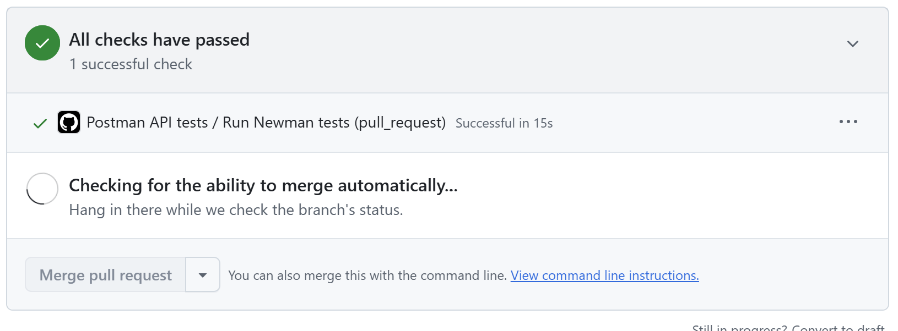

# ReqRes API QA Assignment

[](https://github.com/grazynabor/API-Testing-Fundamentals/actions/workflows/postman-api-tests.yml)

Automated API tests for the public [ReqRes](https://reqres.in) API, prepared as a Postman collection and executed in CI with Newman.

## Contents

- **Assignment 1:** five happy-path tests and four negative/non-2xx tests with automated assertions.
- **Assignment 2:** five exploratory contract-validation requests documented in the report and available in the Postman collection.
- **GitHub Actions:** Assignment 1 runs automatically for pull requests created from branches in this repository.
- **Test reports:** each CI run produces a GitHub summary plus HTML, JUnit XML and JSON reports.

## Test coverage

- GET paginated list of users
- GET single user
- POST create user
- PUT update user
- DELETE user
- 404 / non-existing resource scenarios
- missing required fields
- empty required values
- response contract validation
- response field data-type validation
- ISO 8601 timestamp validation
- unexpected / additional fields
- exploratory API contract validation

## Repository structure

```text
.
├── .github/workflows/postman-api-tests.yml
├── docs/
│   ├── ReqRes_API_QA_Assignment_Report.pdf
│   └── images/ci-success.png
├── postman/
│   ├── ReqRes_API_Assignment.postman_collection.json
│   └── ReqRes_API_Assignment.postman_environment.json
├── scripts/
│   ├── generate-test-summary.mjs
│   ├── run-postman-tests.mjs
│   └── validate-postman-files.mjs
├── .gitignore
├── package.json
└── README.md
```

## CI example

The pull-request workflow runs the Postman/Newman test suite automatically before merge.



## Test reporting

Every GitHub Actions run provides three levels of reporting:

1. **GitHub Actions job summary** — a quick pass/fail overview with request and assertion counts directly in the workflow run.
2. **HTML report (`newman-report.html`)** — a human-readable report with request and assertion details.
3. **JUnit XML (`newman-results.xml`) and JSON (`newman-results.json`)** — machine-readable formats for CI integrations and further processing.

All generated report files are uploaded together as the `newman-test-reports` workflow artifact and retained for 14 days.

## Security: API key

The repository contains only the placeholder `PASTE_YOUR_REQRES_API_KEY_HERE`. Do not commit a real ReqRes API key.

For GitHub Actions, add the key as a repository secret:

1. Open the repository on GitHub.
2. Go to **Settings > Secrets and variables > Actions**.
3. Select **New repository secret**.
4. Use the name `REQRES_API_KEY`.
5. Paste the real ReqRes API key as the value and save it.

The workflow injects the secret at runtime. The key is not written back to the tracked Postman environment or uploaded as a test artifact.

## Run locally

Prerequisites:

- Node.js 22 or newer
- a ReqRes API key

Install dependencies once:

```bash
npm install
```

### PowerShell

```powershell
$env:REQRES_API_KEY = "your-reqres-api-key"
npm test
```

### macOS or Linux

```bash
export REQRES_API_KEY="your-reqres-api-key"
npm test
```

The command validates the Postman JSON files and runs only the automated **Assignment 1** folder. The run generates HTML, JUnit XML and JSON reports under `reports/`.

## Pull request workflow

The workflow is triggered by:

- every pull request;
- a manual run from the **Actions** tab using `workflow_dispatch`.

The API job performs the following steps:

1. checks out the repository;
2. sets up Node.js 22;
3. installs Newman and the HTML reporter;
4. validates the collection and environment JSON files;
5. verifies that `REQRES_API_KEY` is configured;
6. runs Assignment 1 with Newman;
7. publishes a readable GitHub Actions summary;
8. uploads HTML, JUnit XML and JSON reports even when a test fails.

Assignment 2 remains exploratory rather than a merge-blocking test suite because its purpose is to observe and assess actual contract behaviour.

## Pull requests from forks

GitHub does not pass repository secrets to workflows started by pull requests from forks. For that reason, the API test job is intentionally limited to pull requests whose source branch belongs to this repository, plus manual workflow runs. Do not change the trigger to `pull_request_target` and execute untrusted pull-request code with repository secrets.
